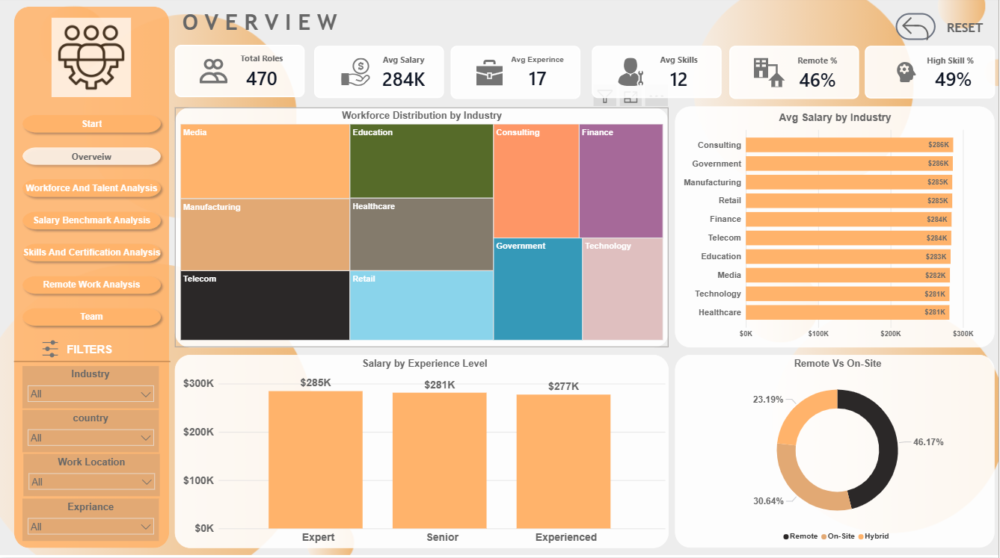
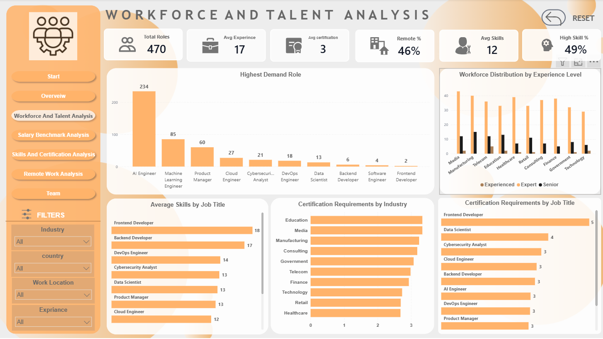
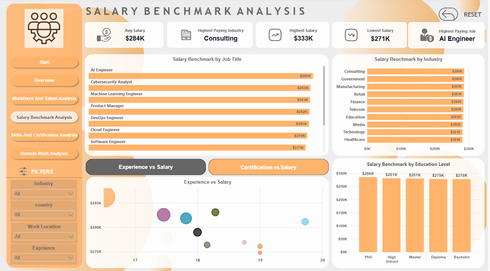
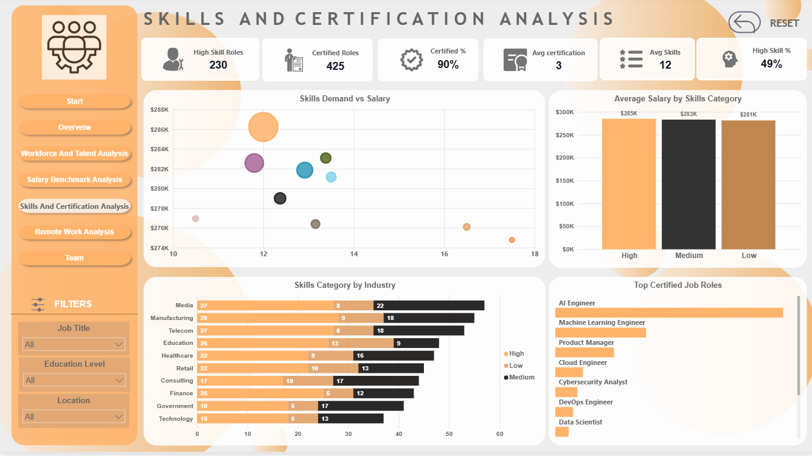
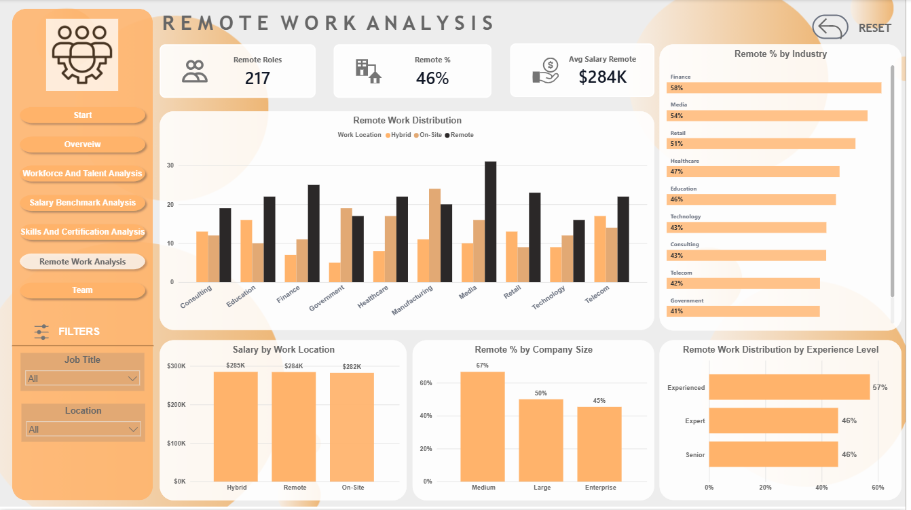

# Workforce and Talent Analysis Dashboard

## 📌 Project Overview

The Workforce and Talent Analysis Dashboard is a Power BI project designed to analyze workforce trends, salary benchmarks, skills demand, certification requirements, and remote work adoption across industries.

The dashboard provides insights into how factors such as job role, industry, experience level, education, skills, certifications, and work arrangements influence workforce demand and compensation. The goal is to support data-driven decision-making for workforce planning, talent acquisition, and career development.

---

## 🎯 Business Objectives

This project aims to answer the following questions:

- Which industries and job roles have the highest demand?
- What factors have the strongest impact on salary?
- How do skills and certifications affect compensation?
- Which industries require the most specialized talent?
- How is remote work distributed across industries and organizations?
- What workforce trends can support better hiring and retention strategies?

---

## 📊 Dashboard Pages

### 1️⃣ Executive Overview

Provides a high-level summary of workforce demand, salary distribution, experience levels, and work arrangements.

#### Key Insights
- AI-related roles are among the most in-demand positions.
- Technology talent demand is concentrated in Media and Manufacturing industries.
- Government and Consulting industries offer some of the highest salaries.
- Remote work represents a significant portion of the workforce.
- Experience positively impacts salary growth.

---

### 2️⃣ Workforce Analysis

Analyzes workforce distribution across industries, job roles, and experience levels.

#### Key Insights
- Demand for technical talent varies significantly across industries.
- AI Engineering remains one of the most sought-after career paths.
- Workforce demand is concentrated in industries undergoing digital transformation.
- Experience continues to be an important factor in workforce demand.

---

### 3️⃣ Salary Benchmark Analysis

Explores salary trends by industry, job role, education level, and skills category.

#### Key Insights
- AI Engineer and Cybersecurity roles receive the highest compensation.
- Consulting industry offers the highest average salary.
- Job specialization influences salary more than education level.
- Education contributes to salary growth, but the impact is moderate.
- Having more skills does not necessarily guarantee the highest salary.

---

### 4️⃣ Skills & Certification Analysis

Examines the relationship between skills, certifications, salary, and industry requirements.

#### Key Insights
- Higher skill levels generally lead to higher salaries.
- AI Engineer and Machine Learning Engineer are the most certification-intensive roles.
- Technology and Finance industries have the highest concentration of highly skilled professionals.
- Certifications are critical in advanced technical careers.
- Workforce demand is increasingly driven by specialized skills.

---

### 5️⃣ Remote Work Analysis

Analyzes remote work adoption across industries, company sizes, experience levels, and work arrangements.

#### Key Insights
- 46% of analyzed roles support remote work.
- Finance and Media industries have the highest remote-work adoption rates.
- Salary differences between Remote, Hybrid, and On-Site roles are minimal.
- Medium-sized organizations show the highest remote-work participation.
- Experienced benefit most from flexible work opportunities.

---

## 🔍 Overall Insights

The analysis reveals several important workforce trends:

- Workforce demand is increasingly driven by specialized technical skills.
- AI Engineering consistently ranks among the highest-demand and highest-paying roles.
- Salary levels are influenced more by job specialization and industry than by education alone.
- Certifications are highly valuable in AI, Machine Learning, Cloud Computing, and Cybersecurity careers.
- Remote work has become a mainstream employment model without significantly affecting compensation.
- Organizations that invest in skills development and flexible work policies are better positioned to attract and retain talent.

---

## 💡 Recommendations

Based on the findings, organizations should consider:

- Investing in AI, Machine Learning, and Cybersecurity talent development.
- Expanding certification and professional development programs.
- Prioritizing recruitment of high-demand technical skills.
- Leveraging remote and hybrid work models to attract talent.
- Aligning workforce planning strategies with industry-specific skill requirements.

---

## 🛠 Tools & Technologies

- Power BI
- Power Query
- DAX
- Data Modeling
- Data Visualization
- Business Intelligence Reporting

---

## 📈 Skills Demonstrated

- Data Cleaning & Transformation
- Data Modeling
- DAX Calculations
- KPI Development
- Workforce Analytics
- Salary Benchmarking
- Skills & Certification Analysis
- Remote Work Analysis
- Data Storytelling
- Dashboard Design

---

## 📸 Dashboard Preview

### Executive Overview

### Workforce Analysis

### Salary Benchmark Analysis

### Skills & Certification Analysis

### Remote Work Analysis

---

## 👤 Author 
This project is Team Working project 
Team Member:
** Sahar Hassan **
** Rehaf Mohamed **

Data Analyst | Power BI Developer

---
## 🚀 Interactive Dashboard

Explore the live Power BI report here:

🔗 **[View Interactive Dashboard](https://app.powerbi.com/view?r=eyJrIjoiZGE1ZDUxNmUtNGJjYy00MGI5LTk0NmQtYzA1MjRhZjI0MDMzIiwidCI6ImMwMjMwYzg0LWRiNzctNGVhYS04OTYyLTJlNzY2MmFhOWQ3NyIsImMiOjl9)**

⭐ If you found this project useful, consider giving it a star.
